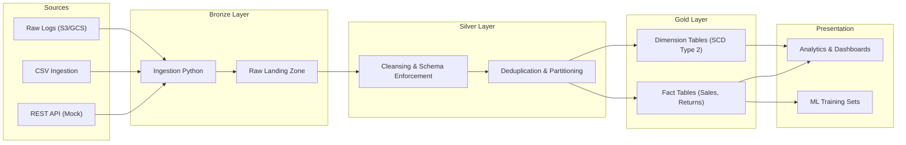

# 🏛️ Data Warehouse Architecture

NexusRetail implements a modern, cloud-native **Medallion Architecture**. This design ensures high throughput, scalability, and data reliability for large-scale analytical workloads.

## 🏗️ Architectural Diagram

---

## 🏗️ Layer Definitions

### 1. 🥉 Bronze (Raw Layer)
*   **Purpose**: Immutable storage of source data "as-is".
*   **Properties**: Minimal transformations, source-of-truth, high data fidelity.
*   **Storage**: Delta Tables / BigQuery External Tables.

### 2. 🥈 Silver (Staging/Cleansing)
*   **Purpose**: Intermediate layer to provide a unified, clean version of data across sources.
*   **Actions**:
    *   **Data Typing**: Converting string-based inputs to proper Timestamp, Integer, and Numeric types.
    *   **Deduplication**: Ensuring primary key integrity.
    *   **Normalization**: Standardizing naming conventions (e.g., camelCase to snake_case).
*   **Governance**: Schema enforcement and data quality checks (DQ).

### 3. 🥇 Gold (Marts/Presentation)
*   **Purpose**: Highly optimized layer for end-user reporting and downstream apps.
*   **Model**: **Star Schema** (Dimensional Modeling).
*   **Features**:
    *   **Partitioning**: By Date (e.g., `event_date`) for query pruning.
    *   **Clustering**: By frequently filtered dimensions (e.g., `customer_id`, `product_id`).
    *   **SCD Type 2**: Handling historical variations of dimension attributes (e.g., customer address changes).

---

## 📈 Data Flow Overview
Data flows asynchronously through the layers. This modular approach allows for re-processing Silver and Gold layers without re-fetching from source APIs in case of logic changes or schema evolution.
